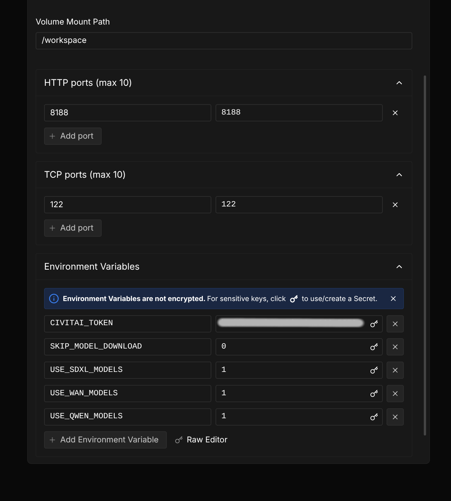

# comfyui-docker

This docker is a convenient way of using your comfyui with your custom models and also get:
- ssh and rsync support through public key
- aria2c parallel downloading of models
- support for civitai tokens on model urls

## How to use it

1) The following environment variables are available to configure docker image build and run (will be explained better later):

- Docker build time variables:

    - `DOCKERHUB_USERNAME`: Basic docker push/tag variable.

        Example:

        ```bash
        DOCKERHUB_USERNAME=your_dockerhub_username make build
        ```

    - `PUBLIC_KEY_PATH`: For allowing ssh and rsync access, set the following env vars.
        Example:
        ```bash
        PUBLIC_KEY_PATH := ${HOME}/.ssh/id_ed25519.pub make build
        ```

- Docker runtime variables:

    - `CIVITAI_TOKEN`: Your civitai token for downloading civitai models that require authentication. You can get it from your civitai account settings.
    This is only needed if you want to download civitai models that require authentication.

    ```bash
    CIVITAI_TOKEN=your_civitai_token make run
    ```
    This will automatically deploy your key during docker build and allow you to access the container using ssh or rsync.


2) Define the models you want.

    This repo provides 7 text files in `model_files/` folder, that contains model urls that will be downloaded efficiently using aria2c (automatically when the container starts).
    You can just do nothing and use them as they are or you can modify them to your needs.

    They are:
    - sdxl.txt: for SDXL 1.0 models, loras and and vaes
    - qwen.txt: for QWEN edit 202509, QWEN image and vaes and QWEN loras
    - wan.txt: for WAN models and loras (WAN2.1, WAN2.2, loras and vaes)
    - hv.txt: for Hunyuan video models and loras
    - upscale.txt: for upscale models
    - others.txt: for any other model you need
    - extra_loras.txt: for any other loras you need

    You dont need to put any model in those files if you dont want. You can keep the default or you can just remove all models from it.

    You can also DISABLE sdxl, qwen, hv or wan by setting the env vars to the docker image when running.
    ```bash

	docker run --rm -it -v /mnt/data-server/comfy-models/:/root/ComfyUI/models/ -p 8188:8188 \
        -e USE_WAN_MODELS=0 \
        ...
    ```
    will disable wan model download. Equivalently you can set:
    - `USE_HV_MODELS={0,1}` to disable/enable hunyuan video models
    - `USE_QWEN_MODELS={0,1}` to disable/enable qwen models
    - `USE_SDXL_MODELS={0,1}` to disable/enable sdxl models
    - `USE_WAN_MODELS={0,1}` to disable/enable sdxl models

    For downloading civitai models, you need to set it with `&token=...` in the url within the model txt file, like this:


    Example:
    ```
    https://civitai.com/api/download/models/358694?type=Model&format=SafeTensor&token=${CIVITAI_TOKEN}
        dir=models/loras/SDXL/
        out=handfinetuning_xl.safetensors
    ```

    For getting the civitai url, go to the download button of the model, click with right button, and copy link. Then add `&token=${CIVITAI_TOKEN}` at the end of the url.

    Then the CIVITAI_TOKEN env var will be automatically expanded and used. But for that you need to pass your CIVITAI_TOKEN to the docker container when you start it, like the example above:

    ```
        docker run -p 8188:8188 -e CIVITAI_TOKEN=${CIVITAI_TOKEN} ...
    ```

## SSH and Rsync access

When running the container locally or any cloud service, you can access it automatically by setting your public key path in the env var `PUBLIC_KEY_PATH` when building the docker image.
Example:
```bash
PUBLIC_KEY_PATH=${HOME}/.ssh/id_ed25519.pub DOCKERHUB_USERNAME=my_username make build
```

* THE CONTAINER WILL EXPOSE SSH THROUGH PORT 122, not the default 22. This will be automatically exposed, but you need to specify 122 port when using services like runpod or vast.ai (see next sessions).

Now you can access your container using ssh or rsync without password. The ssh server is already installed.

When running the container on runpod or vast.ai, prefer a direct pod access using public ip, rather than using the http tunneling they provide, as it is much faster.
This is how you tunnel your local port comfyui port to the remote port port of the container:

```bash
ssh -i ~/.ssh/id_ed25519 -L 8188:localhost:8188 root@<your_pod_public_ip>
```

(If you set up your public key as explained above all should work without password)

You can check your pod public ip in runpod or vast.ai dashboard.

Then you can access comfyui in your local browser at `http://localhost:8188`

This is faster than using the http tunneling they provide.

Then you can access your container using:
```bash

## Running the container locally

This repo provides a Makefile to make it easier to build, push and run the docker image.


- For building:
```bash
DOCKERHUB_USERNAME=my_username make build
```

Remember login first with `docker login`

- For pushing:
```bash
DOCKERHUB_USERNAME=my_username make push
```

- For running:
```bash
CIVITAI_TOKEN=my_token DOCKERHUB_USERNAME=my_username make run
```

## Creating a runpod template

For creating runpod template, set the following variables:



Also remember configuring your docker repo credentials to allow runpod to pull it.


